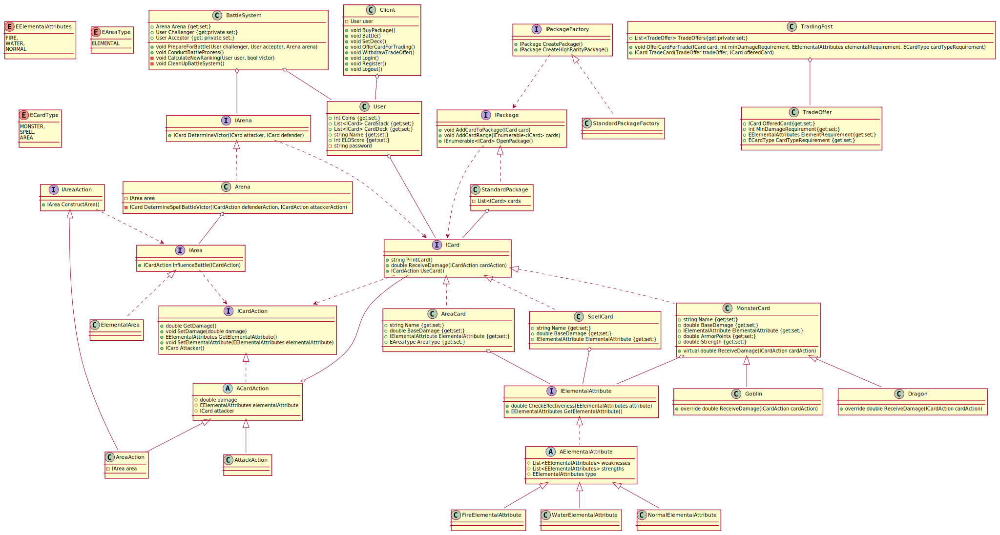

# SWE1-MTCG

Program for trading and battling with and against each other in a magical card-game world.

# Special explanatory notes

Further steps are explained in this section.

## Class diagram

## Elemental attributes

Due to future plans involving the decorator pattern, elemental attributes are currently implemented as classes. There is also an elemental attribute enum called "EElementalAttributes". For unit testing I used TestCaseSource to avoid writing lots of lines just for 1 unit test. New elemental attributes can be easily added. A new attribute just needs to inherit from AElementalAttribute and it needs to define it's weaknesses and strengths.

Future plans:
* New elemental attributes
	* Ice
	* Electric
	* Darkness
	* Light
	* Wind
* Immunities (e.g.: Darkness is immune to Normal)

## Cards

All cards have the following attributes in common:

* Name
* BaseDamage
* Description
* ElementalAttribute

According to the task, only two card types are required (Spell-Cards, Monster-Cards). I'm planning to introduce new card types to the MTCG-Project (e.g.: Area-Cards, Trap-Cards).

### Monster-Cards

Monsters are not that special. Although there is a mechanic, which makes certain monsters immune or extremely prone to monsters/spells, I thought it would be more interesting if they had something else that makes them more "unique". That's why monsters have the following additional attributes:

* Toughness
* Strength

The immunity/susceptibility is implemented using inheritance. The elemental attribute isn't used in monster-only-fights.

To implement monster types with different behavior in ReceiveDamage the method is virtual. The monster types are implemented with inheritance (according to task).  I am not really sure how to solve the insta-kill mechanic with inheritance alone. Currently I am taking advantage of the fact that ReceiveDamage can't return negative values due to my implementation. As soon as a negative value is detected, the opponent wins.

### Spell-Cards

Spell-Cards use a rock-paper-scissors mechanic in spell-only-battles. Otherwise, they are not that spectacular. Possible "improvements":

* Mana

Spell-Cards can be affected by Area-Cards.

### Area-Cards

The fight between players takes place in an arena. The arena has an area. The area can be changed using Area-Cards. For example, areas can influence Spell-Cards (e.g.: "Electric field" changes water based spells into electric ones).

#### Areas and AreaActions

Due to implementing an interface called IArea, lots of different "areas" can be implemented. If a player wants to construct an area, a check is conducted (check whether the card played is an area card). Another action is implemented, which implements the IAreaAction interface. 

### Trap-Cards

Traps can be used to inflict major damage in the next round. You are probably going to lose the current round, but the payoff should make it worthwhile.

### Card-Actions

Due to future plans (area cards, trap cards) I need CardActions (attack, area, trap). Trap and area actions are special, because they influence the arena. Attacks are passed through an area (and are possibly influenced) to "reach" the enemy.
